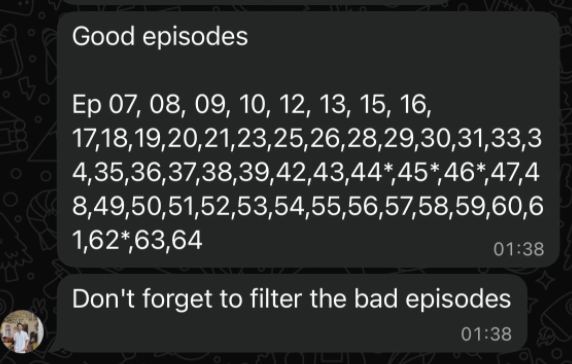
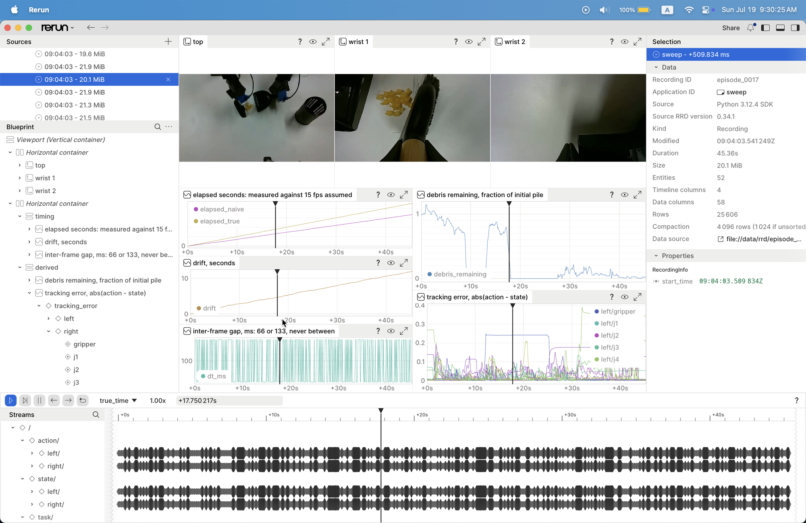
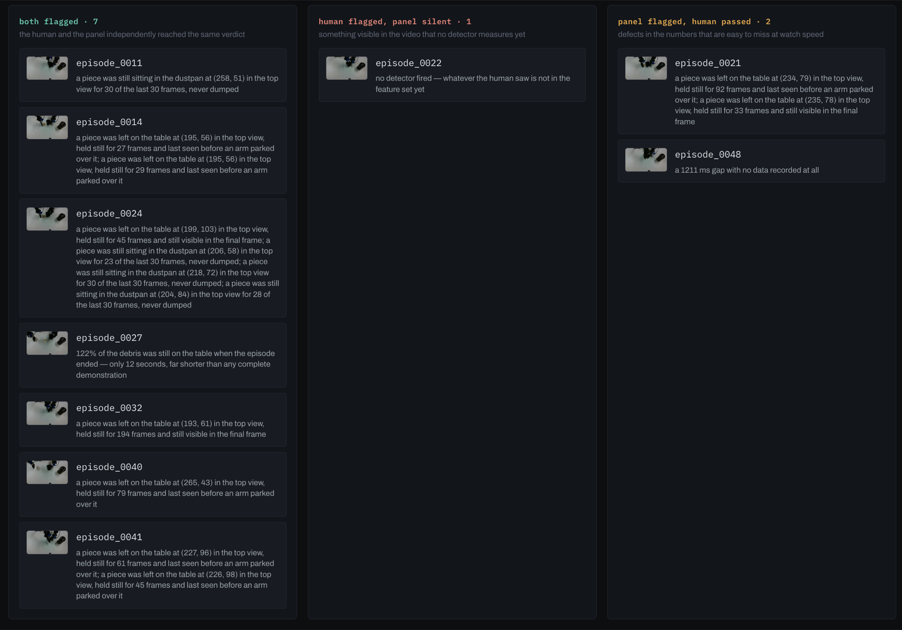
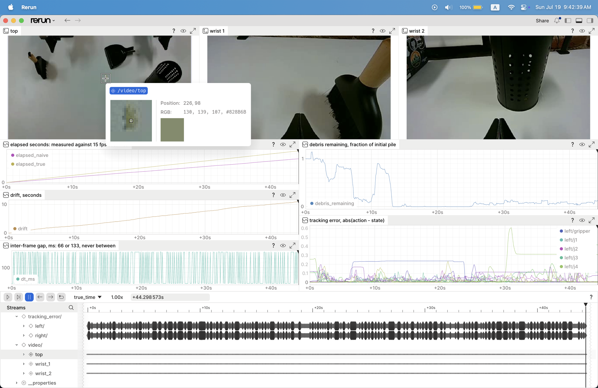
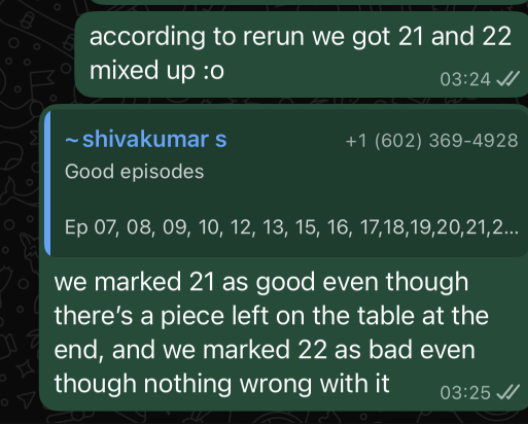
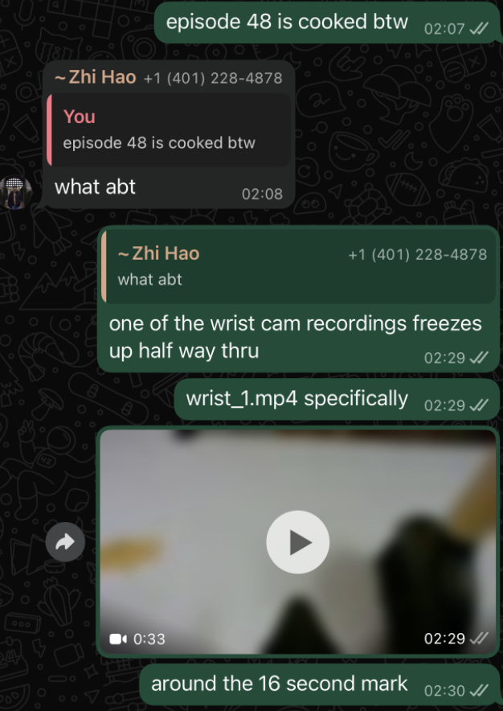

# winnow

Query-driven triage and curation for robot demonstration data, built on the
[Rerun](https://rerun.io) Query API.

Fifty-eight bimanual teleoperation episodes: two arms, a brush and a dustpan,
sweeping pasta debris on a table and dumping it into a basket. Three cameras,
14 degrees of freedom, 28,219 frames, 42 minutes of wall clock.

The question that motivates all of it is the boring one that decides whether a
policy works: **which of these episodes should you actually train on?**

The videos are 424x240 at about 11 Hz. You cannot answer that by scrubbing
through them. So the corpus goes into a Rerun catalog and the answer is a query.

---

## The state of the art is a person watching everything

Here is how the corpus arrived. A teammate sat through all 65 recordings and
sent back a list.



That is one bit per episode, produced by a human at watch speed, and it does not
say *why*. It is also the only quality signal the dataset ships with. Everything
below is an attempt to do better than it — and, where the two disagree, to
settle the argument with evidence instead of seniority.

Episodes 0-6 are dropped up front: an early batch recorded with the wrong action
and speed settings, a known-bad *batch* rather than seven defects to rediscover.
That leaves 58 episodes, of which the teammate flagged eight: 11, 14, 22, 24,
27, 32, 40 and 41.

## The corpus is mis-timed, and a query is how you find out

`meta.json` declares `"fps": 15` for every episode. The recorder's own
timestamps disagree:

| | claimed | measured |
| --- | --- | --- |
| frame rate | 15 Hz | **11.12 Hz** |
| inter-frame gaps that are double length | 0% | **34.7%** |
| duration of the corpus | 31.4 min | **42.2 min** |

Every third frame arrives a full period late. The gap distribution is bimodal at
66 ms and 133 ms with essentially nothing in between, which is the signature of
dropped ticks rather than jitter. The likely cause is bandwidth: three RealSense
cameras on USB 2.0 cannot sustain 15 fps, and the recorder wrote the rate it
asked for instead of the rate it got.

This matters downstream. A run loop replays action chunks at whatever rate the
dataset metadata declares, so a policy trained on this corpus and deployed at
15 Hz executes every motion **1.35x faster than it was demonstrated**. On a
contact-rich task like sweeping, that is the difference between brushing debris
and scattering it.

Nothing about that is visible in the video. It is visible immediately in the
index.

## What the pipeline does

Each episode becomes one `.rrd`, which the catalog treats as one segment, so a
single query addresses the whole corpus. Every episode carries four indexes:

| index | kind | what it is |
| --- | --- | --- |
| `frame_idx` | sequence | raw sample number |
| `true_time` | duration | elapsed seconds from the recorder's clock |
| `naive_time` | duration | `frame_idx / 15`, what `meta.json` claims |
| `log_time` | timestamp | absolute wall clock |

Logging both `true_time` and `naive_time` makes the defect a first-class,
queryable quantity rather than a footnote. Scrubbing between the two timelines
in the viewer shows them drift apart in real time.



The blueprint pairs the three camera streams with the derived signals, so every
claim the pipeline makes has the footage that produced it directly above it.
`drift, seconds` is the gap between the two clocks: more than ten seconds by the
end of a forty-five second episode. `inter-frame gap` is 66 or 133 ms and never
anything between. `debris remaining` is the fraction of the initial pile still
on the table, read off the top camera.

### Reduce the corpus in SQL

`dataset.reader()` returns a DataFusion frame, so cross-episode analysis is
ordinary SQL over every segment at once. Fifty-eight episodes and 28,219 frames
reduce to one row each in **under two seconds**:

```sql
SELECT rerun_segment_id AS episode,
       count(*)                          AS n_frames,
       round(count(*) / max(elapsed), 2) AS true_hz,
       round(100.0 * avg(dropped), 1)    AS pct_dropped
FROM frames
GROUP BY episode
```

### Put it on an honest clock

`reader(using_index_values=...)` asks for the state of the world at times *you*
choose and lets latest-at fill the rest, which turns an irregular capture into a
uniform one:

```
before  dt 66.7-133.7 ms, sd 31.7 ms, 11.13 Hz actual against 15 fps claimed
after   dt 100.0-100.0 ms, sd  0.0 ms
```

### Let a predicate define the dataset

```
python winnow/export.py --where "pct_dropped < 40 AND debris_end < 0.3" --out curated_v1
```

The predicate is written into `manifest.json` next to the resulting episode
list, so "which episodes did v1 train on" has an exact answer instead of a
folder somebody copied by hand. Change the clause, get a different dataset,
diff the manifests.

## Detecting bad demonstrations

The pipeline derives signals that say *why* an episode is bad. Every feature is
a plain physical quantity: tracking error, inter-frame gaps, frozen frames,
debris remaining. None are tuned against the human labels; the labels are only
used afterwards, to score the detectors.

| detector | fires | what it measures |
| --- | --- | --- |
| `debris_outside_basket` | 7 | a piece at rest, outside the basket, that nobody came back for |
| `task_not_completed` | 1 | the pile is still on the table when the episode ends |
| `truncated` | 1 | the episode is far shorter than any complete demonstration |
| `capture_stall` | 1 | a gap in the recording with no data in it at all |

The detector that mattered most reads the end state of the task. Sweeping
succeeds only when the debris is inside the basket, so the failure surface is
not "how much yellow remains" but "is there a piece at rest somewhere else":
on the table, or still in the dustpan. Three episodes fail exactly that way and
are invisible to every aggregate signal, because one piece of pasta is a
rounding error against the initial pile.

Two resting surfaces need different evidence. A piece on the white table is
found by tracking a static yellow blob with bright surroundings, then requiring
positive proof of cleanup: after the blob was last seen, that patch must appear
bare and bright for several consecutive frames. Absence is not proof, because an
arm parked on top of a piece also makes it vanish — which is exactly what
happens in ep 40. A piece in the pan is checked only over the final seconds,
when the arms are parked, since a loaded pan mid-carry is correct behaviour. The
basket is located per episode as the one dark object that survives a pixelwise
median, rather than by a hardcoded screen region, because the dustpan drifts
through the same corner during the dump.

## The dashboard is a two-way comparison, not a score



The panel flags nine episodes. Seven of them are on the hand-labelled bad list.
One episode the human failed, the panel passed. Two the human passed, the panel
failed. The dashboard presents that as three columns rather than an accuracy
figure, because the labels are one person's reading of 424x240 video and the
detectors are measurements, and when they disagree the useful move is to go and
look.

Which is possible, because the detections are specific enough to check. Not a
quality score — a sentence with a coordinate in it:

> a piece was left on the table at (226, 98) in the top view, held still for 45
> frames and last seen before an arm parked over it

Open the footage and hover that pixel.



It is there. About twenty pixels, in one of twenty-eight thousand frames. That
specificity is the product: every flag comes with the frame, the coordinate and
the reason, so a human can overturn it in ten seconds if it is wrong.

## Where the panel and the human disagree

All three disagreements went back to a human for review, and all three resolved
in the panel's favour.

| episode | hand label | panel | on review |
| --- | --- | --- | --- |
| 22 | bad | clean | the demonstration looks clean; the label is wrong |
| 21 | good | defect | a piece really is left on the table |
| 48 | good | defect | the capture freezes for 1,211 ms mid-episode |

Episodes 21 and 22 turned out to be transposed in the hand list:



Episode 48 is a different kind of defect. `capture_stall` fires on a 1,211 ms
window with no rows in it — not a long gap, an absence. The footage says the
same thing:



Both of those were on the good list. Both are now out of the training set.

Three adjudications is a small sample and none of this is an accuracy claim. It
is the argument for the shape of the tool: a detector that produces checkable
sentences turns "is this dataset any good" into a question two people can settle
in an afternoon.

### A detector that was deleted

An `incomplete_sequence` detector counted gripper open/close cycles and flagged
any episode below the corpus modal value of eight. It looked like the strongest
signal in the panel, catching five of the eight labelled-bad episodes.

It was measuring nothing. The count comes from thresholding the gripper signal
at the midpoint of each episode's own range, and sweeping that threshold from
30% to 70% changes the count for *every* episode in the corpus, known-good ones
included:

```
ep  8 (good)      [4, 8, 8, 8, 6]
ep 33 (flagged)   [6, 8, 4, 4, 4]
```

It was reporting where the threshold sat, not what the robot did, so it was
removed rather than recalibrated. Deleting it costs one labelled-bad episode and
removes five spurious flags.

### What is not robust

An adversarial pass ran three lenses over the stray-debris detector —
overfitting, false positives, robustness. Two passed. The robustness lens
failed: perturbing each constant by 25% one at a time, 4 of 17 change the
verdict, and all four are the chroma gates separating pasta from the wooden
brush handle. They are calibrated to this rig, this pasta and this lighting.
The geometric and temporal gates are much steadier, and the score separates
widely at the cut — lowest flagged 1.40, highest unflagged 0.55, every
known-good at or below 0.10 — so the threshold itself is not load-bearing.

Full sweep, and the overfitting audit, in [`docs/detection.md`](docs/detection.md).

## The curated set trains a policy

Curation is only worth anything if something consumes it, so the surviving
episodes go through to an ACT policy. `bundle.py` writes the 49 episodes the
panel did not reject, resampled onto a uniform 10 Hz grid — 21,575 frames, three
cameras, 14 DOF — with the rejection reasons recorded in the manifest beside the
episode list.

```
modal run train/modal_act.py --step convert                        # -> LeRobotDataset
modal run train/modal_act.py --step train --steps 100              # smoke test, cents
modal run train/modal_act.py --step train --gpu H100 --steps 25000 # the real run
modal run train/modal_act.py --step openloop                       # sanity check
```

Conversion is a separate remote step from training: building the dataset
re-encodes ~19k frames across three cameras, and there is no reason to hold a
GPU while it does.

The open-loop check drives the trained policy on real observations with no arm
in the room. It cannot tell you the policy sweeps — behaviour-cloning loss and
open-loop action error are both weak proxies for task success. What it does
establish is that the artifact loads, consumes real observations, and returns
finite, well-formed action chunks in the right units, which is the class of
failure worth ruling out before anyone plugs in a robot.

## Running it

```
export WINNOW_SRC=/path/to/episode_folders
uv sync
make                  # vision -> transcode -> ingest -> metrics -> detect
make view             # every recording at once; switch in the Sources panel
make view-one EP=32   # a single episode, much faster to start
make view-flagged     # only the episodes the panel rejected
make episodes         # list every episode and what fired on it
make ui               # the triage dashboard
```

`transcode.py` is not optional: Rerun's `AssetVideo` rejects MPEG-4 Part 2,
which is what the recorder wrote. The re-encode also rewrites presentation
timestamps from the recorder's clock, so the video plays at the speed the
demonstration actually happened.

Note the pinned `datafusion~=53.0`. Version 54 is rejected outright by
rerun-sdk 0.34.

## Layout

| file | what it does |
| --- | --- |
| `paths.py` | source and artifact locations, robot joint layout |
| `transcode.py` | MPEG-4 to H.264, timestamps from the recorder's clock |
| `vision.py` | debris, motion and luma read off the camera streams |
| `ingest.py` | one `.rrd` per episode, four indexes each |
| `catalog.py` | serves the corpus, reduces it to a row per episode in SQL |
| `align.py` | resamples onto a uniform grid via `using_index_values` |
| `features.py` | one physical feature vector per episode |
| `detect.py` | the detector panel, scored against the human labels |
| `residual.py` | debris left outside the basket, per episode |
| `bundle.py` | the curated training set, on a uniform clock |
| `export.py` | a `WHERE` clause becomes a curated training set |
| `blueprint.py` | viewer layout pairing cameras with derived signals |
| `webdata.py` | the JSON the dashboard reads |
| `train/modal_act.py` | convert, train and open-loop check on Modal |

## Query API notes

Built against `rerun-sdk` 0.34.1, where the Query API is `rr.catalog` and
`rr.server`. Things that cost time and are not obvious from the docs:

- `rr.dataframe` no longer exists. `load_recording()`, `.view()`, `.select()`
  and the `filter_*` methods were removed across 0.32 and 0.34.
- `rr.server.Server(datasets={...})` runs a catalog locally. No account, no
  cloud, and it accepts a plain list of `.rrd` paths.
- Every scalar column comes back as a one-element list, so `Scalars:scalars`
  needs a `[1]` subscript in SQL or `.explode()` in pandas.
- `filter_contents()` changes which *rows* exist, unlike a `select()` which only
  prunes columns. Filtering two entities then selecting one yields rows at the
  other entity's timestamps, filled with nulls.
- `get_index_ranges()` returns pandas `Timedelta` objects for duration indexes,
  not integers.
